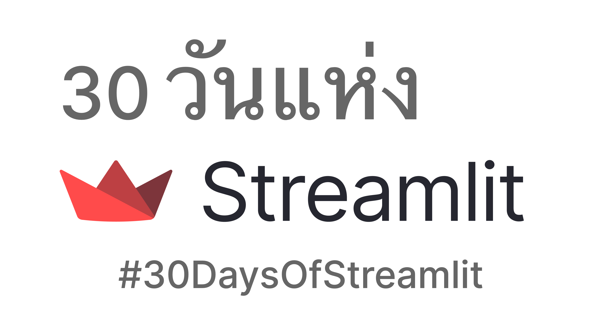

# 30 วันแห่ง Streamlit (30 Days Of Streamlit) 🎈

GitHub รีโพสำหรับ `30 วันแห่ง Streamlit` (`#30DaysOfStreamlit`) นี้ได้ถูกแปลเป็นภาษาไทยโดย ดร.ชนินทร์ นีนทเสนามาตร์ ([dataprofessor](https://github.com/dataprofessor))

`#30DaysOfStreamlit` เป็นอีกหนึ่งแหล่งของการเรียนรู้เกี่ยวกับการใช้งาน Streamlit เพื่อสร้างเว็บแอป (web application)

[Streamlit](https://streamlit.io) เป็นไพธอนไลบรารี (Python library) สำหรับการเขียนเว็บแอป ในลักษณะ low-code โดยใช้เพียงไม่กี่บรรทัดก็สามารถ deploy เป็นเว็บแอปที่ใช้งานได้อย่างสมบูรณ์แบบ

## วิธีเข้าร่วม

สิ่งที่คุณต้องมีเพื่อเข้าร่วมมีดังนี้: 🧠
- คอมพิวเตอร์
- ความเข้าใจพื้นฐานของไพธอน
- ความอยากรู้ และความสนใจ

บทเรียนใหม่ฯ จะออกทุกวันในเดือนเมษายน 2022 ผ่านช่องทางดังต่อไปนี้
- [Twitter](https://twitter.com/streamlit)
- [LinkedIn](https://www.linkedin.com/company/streamlit/posts/?feedView=all) 
- เว็บแอปของ [`#30DaysOfStreamlit`](https://share.streamlit.io/streamlit/30days/) 

คุณสามารถทำภารกิจประจำวัน และแบ่งปันผลงานของคุณผ่านช่องทาง Twitter หรือ LinkedIn และรับรางวัลเป็น Streamlit swag สุดเจ๋ง 😎

## เนื้อหาของบทเรียน

คุณสามารถเรียนรู้เกี่ยวกับการใช้งานของ Streamlit โดยการเข้าร่วมกิจกรรมการเรียนรู้นี้

`30 วันแห่ง Streamlit` สามารถแบ่งออกเป็น 3 ระดับความยากที่เหมาะกับผู้เข้าร่วมทุกระดับทักษะดังนี้

| ระดับเริ่มต้น (วันที่ 1-7) | ระดับกลาง (วันที่ 8-23) | ระดับสูง (วันที่ 24-30) |
| :---        |    :----   |          :--- |
| การติดตั้งสภาพแวดล้อมสำหรับการพัฒนาโค้ด, การติดตั้ง Streamlit และการสร้างเว็บแอปด้วย Streamlit  | เรียนรู้เกี่ยวกับการใช้งาน [คำสั่งต่างๆ ของ Streamlit](https://docs.streamlit.io/library/api-reference) ในแต่ละวันที่คุณสามารถใช้ในการพัฒนาเว็บแอปด้วย Streamlit | เรียนรู้เกี่ยวกับเรื่องสำคัญต่างๆเช่น การใช้ session state, การบริหารจัดการข้อมูลและหน่วยความจำอย่างมีประสิทธิภาพ, การจัดรูปแบบของแอป และอื่น ๆ

## รางวัล

หากการเรียนรู้เกี่ยวกับวิธีที่เร็วและง่ายที่สุดในการสร้างแอปข้อมูลไม่เพียงพอ นอกจากนี้คุณยังสามารถลุ้นรับรางวัล Streamlit สุดเจ๋งอีกด้วย

หลังจากที่คุณทำภารกิจการเรียนรู้ประจำวันเสร็จแล้ว คุณสามารถแบ่งปันผลงานของคุณผ่านช่องทาง [Twitter](https://twitter.com/streamlit) และ [LinkedIn](https://www.linkedin.com/company/streamlit/posts/?feedView=all) 🎁

## แหล่งการเรียนรู้

- เว็บแอปของ [`#30DaysOfStreamlit`](https://share.streamlit.io/streamlit/30days/) ที่มีการโพสต์ภารกิจการเรียนรู้ประจำวัน
- [Twitter](https://twitter.com/streamlit) และ [LinkedIn](https://www.linkedin.com/company/streamlit/posts/?feedView=all) ที่จะอัพเดทข่าวสารและสาระน่ารู้เกี่ยวกับ Streamlit ได้ทุกวัน
- [Documentation](https://docs.streamlit.io/) และ [cheat sheet](https://docs.streamlit.io/library/cheatsheet) ที่สรุปชุดคำสั่งต่างๆ ของ Streamlit
- [Gallery](https://streamlit.io/gallery) เป็นการรวบรวมของแอปจากชุมชนผู้พัฒนาที่สามารถให้แรงบันดาลใจ และสามารถใช้เป็นเทมเพลตตัวอย่างได้
- [Blog](https://blog.streamlit.io/how-to-master-streamlit-for-data-science/) สำหรับเคล็ดลับและข้อมูลล่าสุดเกี่ยวกับ Streamlit

## การแปล

ถ้าคุณอยากช่วยเราขยายขอบเขตการเข้าถึง `#30DaysOfStreamlit` คุณสามารถช่วยเราแปลบทเรียนเหล่านี้เป็นภาษาที่คุณถนัด และโปรดเพิ่มลิงค์ของคุณด้านล่างนี้
- [ภาษาอังกฤษ](https://github.com/streamlit/30days) (Official): 
- [ภาษาจีน](https://github.com/TeddyHuang-00/30days-Chinese) (แปลโดย [TeddyHuang-00](https://github.com/TeddyHuang-00)): 
- [ภาษาสเปน](https://github.com/streamlit/30days-spanish/) (แปลโดย by [Emiliano Rosso](https://github.com/arraydude)): 
- [ภาษาฝรั่งเศส](https://github.com/streamlit/30days-French) ((แปลโดย [Charly Wargnier](https://github.com/charlyWargnier/)): 
- [ภาษาโปแลนด์](https://github.com/streamlit/30days-polish) (แปลโดย [Michał Nowotka](https://github.com/sfc-gh-mnowotka)): 
- [ภาษาโปรตุเกส](https://github.com/franciscoed/30days) (แปลโดย [franciscoed](https://github.com/franciscoed)): 
- [ภาษารัสเซีย](https://github.com/kseniaanske/30days) (แปลโดย [Ksenia Anske](https://github.com/kseniaanske)): 
- [ภาษาไทย](https://github.com/dataprofessor/30days) (แปลโดย [dataprofessor](https://github.com/dataprofessor)): 
